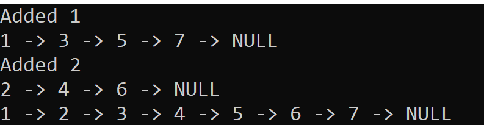

# Challenge 08: ZipLists

Author: Steven Boston
Planning and Design with: Joshua Haddock

The objective in this task was to create a function that given two LinkedLists returns a List whose Nodes are a combination of the two originals, alternating one from each.

## Whiteboard Process

## Approach and efficiency

This method of zipping the lists maintains a high level of efficiency by using a small and static number of additional variables and looping through the Lists minimally (only once, and only to the length of the shorter list). This puts us in O(1) territory.

## Solution

The approach for our ZipLists method is to create two variables that maintain the current position in the node sequences, and two that maintain the next two nodes in the lists. From there we change the pointers so that the first list's Node points to the second, and the second points to the next entry in the first list.

We make 2 checks to handle edge cases:

- **Empty Array:** Our base solution handles the second list being empty without any trouble, so a quick check on the Head of the first list to transplant list2's Head node if necessary solves this issue.

- **Second Array is Larger than First:** again, our solution handles the first list being the outlier seamlessly, so a check on the next value in the first list will alert us if we need to keep the connection to the outlier Nodes in list2.
