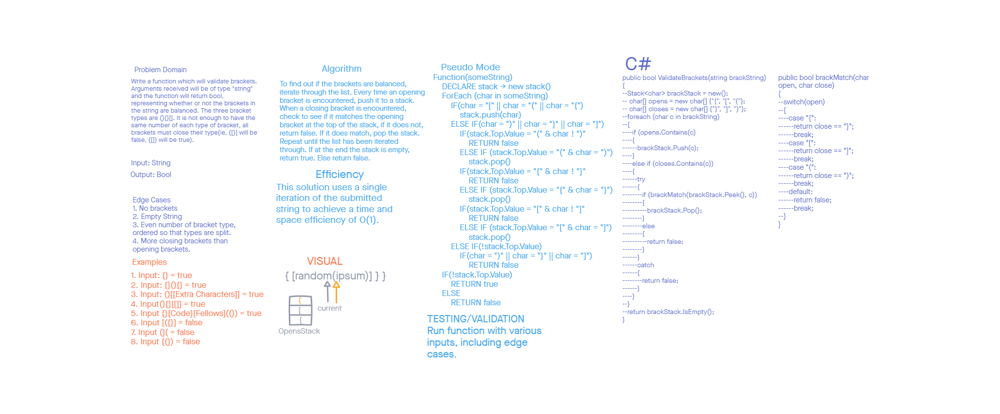

# Challenge 13: Validate Brackets

Author: Steven Boston
Designed in Collaboration with: Joshua Haddock

Challenge 13 asks us to create a method that takes in a string and checks that the use of brackets in the string is valid. 

## Whiteboard Process

## Approach & Efficiency

This method interates through the string only once, checking each character. This results in a big O time of O(n) and space of O(1).

## Solution

The solution consists of the method `ValidateBracketString(string)` and the supporting method `BracketMatch(char)`. Simply run the first method and it will return a boolean. 
