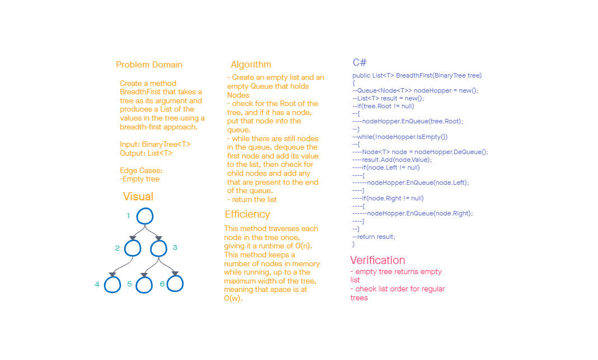

# Challenge Summary

This challenge asks us to write a method that takes a tree and returns a list of all the values in the tree, using a breadth-first approach.

## Whiteboard Process

## Approach & Efficiency

As the challenge requires, this method uses a breadth first approach with a Queue and a while loop. This results in a runtime of O(n) and space of O(w).

## Solution

This solution is comprised of one method:

- BreadthFirst(BinaryTree<T>) => List<T>
