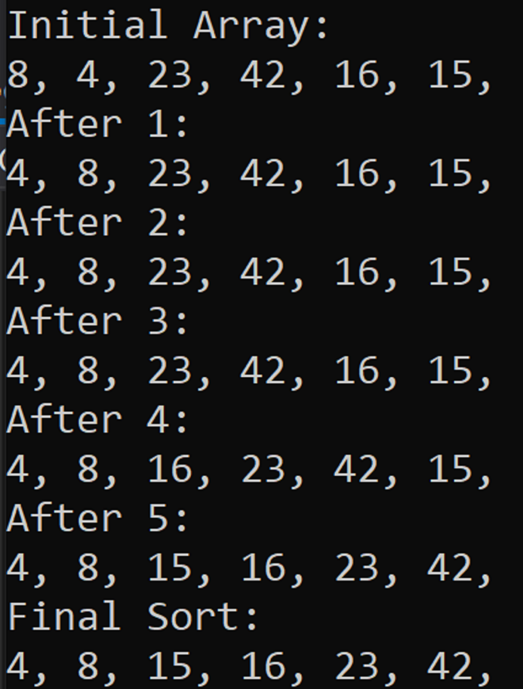

# Challenge Summary

Challenge 26 requires us to, given an example, implement a method InsertionSort that accepts an array of integers and sorts it by inserting the values in their proper order one by one. 

## Solution

This solution adds one method to CodeChallenges in the file ArraySorts.cs:

- InsertionSort(int[]) -> Sorts an array of integers in place.

## Article: Insertion Sort

An insertion sort handles the sorting of an array from front to back, one value at a time. Each new value in the sequence is considered, and compared to the previous value and switched with that value until it has reached its proper position.

For each position in the array, we look at the value of that position and compare it with the previous value. In this example, we can see that the first iteration has switched 4 and 8, then the second makes no changes, as 23 is greater than 8. Next we proceed to switch 16 and 42, and then 16 and 23. At the end of the iterations, we are left with sorted sequence of 4, 8, 15, 16, 23, and 42. This can be handled similarly on any array of integers, and come back with predictable results.

