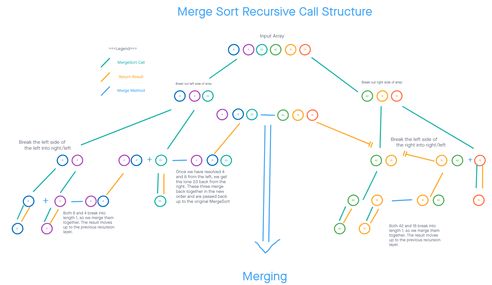
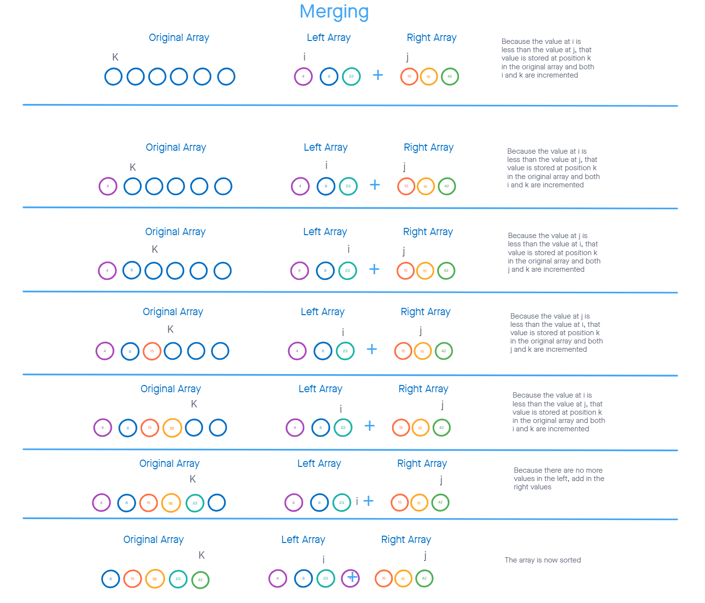

# Challenge Summ

Author: Steven Boston
Written in collaboration with: Charles Hubert Bofferding IV

Challenge 27 requires us to, given an example, implement a method MergeSort that accepts an array of integers and sorts it recursively by breaking the array into halves and then merging the lowest tier of results together back up the recursion chain.

## Solution

This solution adds two methods to CodeChallenges in the file ArraySorts.cs:

- MergeSort(int[]) -> Sorts an array of integers in place via recursion.
- Merge(int[], int[], int[]) -> support method for MergeSort, sorts two sorted arrays into one. 

## Article: MergeSort

`MergeSort` begins with an array of integers. The first order of business with a recursive method is to check whether we have reached the end of the chain. In this case, we know we have reached the end of the chain when the array length is 1 or less. Assuming it is not, we proceed to split the array into two parts: right and left. Each of the halves has the MergeSort Method called on it, meaning that these same operations proceed until we have broken down the array into individual pieces.

From the lowest layer, the recursions begin to resolve upward. We can see in the left side example above that eventually MergeSort calls itself on a left array of [8] and a right array of [4], both of which will make no further calls down the stack. Now this layer of the recursino can proceed, calling merge on Left, Right, and the array the was fed in (in this case the previous layer's Left array). More on merge in a moment, but for now suffice it to say that it takes two sorted arrays and merges them together into a sorted result.

That lower level merge gives us [4, 8], which then moves up the chain to meet [23] and become [4, 8, 23], which then proceeds back up to the initial level to meet the other recursion branch that began with the initial right side of the array.

###Putting the values back together again

So how does the helper method Merge work?

Merge takes in two arrays, which we presume to be sorted and also to represent halves of a third array. It establishes three values, `i`, `j`, and `k`. Each of these functions as a counter that keeps track of which position in each of the three arrays we are on.

As long as both Left and Right have not had their counters overtake their length, we will compare the values at each counter, assign the lesser of the values to the third array, and increment the counter on the third array and the array we acquired the value from. Once we run out of values from one side, we simply add the rest of the values from the other side to the remaining slots in the thurd array.

After all of these operations, the original array has had its values reassigned to be sorted! Hooray!
