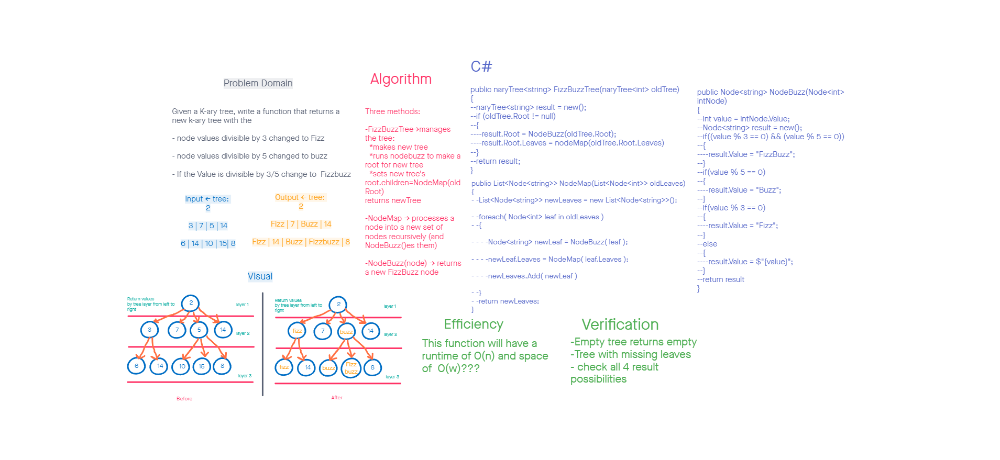

# Challenge Summary

Author: Steven Boston
Written in collaboration with: Miriam Silva

This challenge requests a method that will take a string and return the first repeated word in the string. Our method utilizes a hash table to track down the repeated word quickly and easily.

## Whiteboard Process

## Approach & Efficiency

RepeatedWord splits the string into an array of words by spaces, then loops the array and checks or stores each word. The runtime efficiency lands at about O(n).

## Solution

This solution adds the RepeatedWords.cs file, which adds one method:

- RepeatedWord(string) -> returns the first word that repeats in a string.
