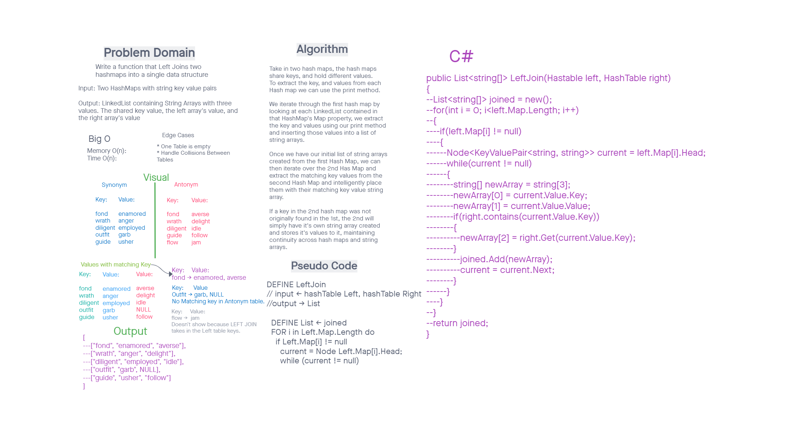

# Challenge Summary

Author: Steven Boston
Written in collaboration with:

- Ben Arno
- Bejamin Ibarra
- Joshua Haddock
- Miriam Silva
- Charles Bofferding
- Jona Brown
- Joel Connell
- Qaalid Hashi

This challenge requests a method that will takes two HashTables and returns the result of a left join between the two. 

## Whiteboard Process

## Approach & Efficiency

This solution requires a single iteration through the first HashTable while checking the second to populate the output list, giving it a runtime and space of O(n).

## Solution

This solution adds the LeftJoinHashTable.cs file, which adds one method:

- LeftJoin(HashTable, HashTable) -> returns a list of string arrays, each in the form of [key, value1, value2]. 

