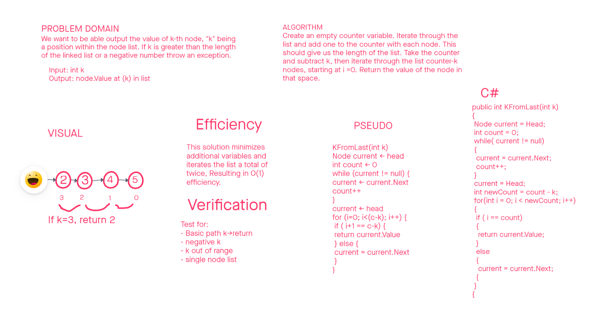

# Data Structures Challenges

Author: Steven Boston
Planning and Design in collaboration with: Joshua Haddock

### Challenge 06: Linked List add Methods

This challenge asked us to add three new methods to our LinkedList class from the previous challenge:

- Append to end of list chain
- Insert before a particular node
- Insert after a particular node

### Challenge 07: kth from last

In this challenge we were tasked with writing a method for our linked list that when given some value k would return the value of the node located kth from the end of the list.

## Whiteboard Process

## Approach & Efficiency

### Challenge 6

Each of the solutions we chose to implement requires the minimum number of repetitions to arrive at the necessary node to make the insertion, minimizing the computational load of the operations.

### Challenge 7 A&E

Our method for finding kth from last first determines list length, then calculates the needed traversals and finds and returns the corresponding value using only 2 traversals and 1 additional variable in memory.

## Solution

### Challenge 6 Solution

This challenge set offers three methods within the LinkedList class:

- `AppendLinked(int value)`: provide a value and this method creates a new node to store the value and adds it to the end of the list chain.
- `InsertBefore(int target, int value )`: enter a target to relate the new value to and a new value and place a new node directly preceding the first insance of the target.
- `InsertAfter(int target, int value)`: the same tactics with InsertAfter allow you to place the new node after the target node instead.

### Challenge 7 Solution

Challenge 7 asked us to find the kth value form the last in our linked list. Our solution was as follows:

- iterate list and count the nodes
- subtract k from the count
- interate to count-k to find and return value
- throw out of range exception directly if k is negative or equal or greater than count.

This solution addresses common edge cases while producing the desired return and maintaining the overall setup of the data structure.
