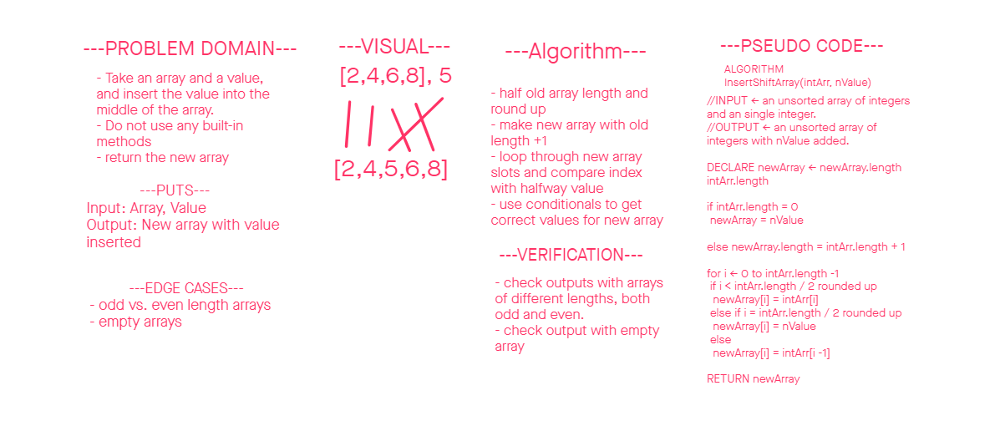

# Insert to Middle of an Array

Design a method that takes in an array and a value, and inserts the value into the middle of the array, adjusting all the initial values accordingly, and return the new array. 

## Whiteboard Process

## Approach and efficiency

Initializing a new array with the correct length is a useful tool that the trappings of C# give us access to. using the length of the original array and Math.Ceiling() allows us to pinpoint the index at which we want the new value. From there a simple algorithm can easily tell the method which values to put where in the new array. 