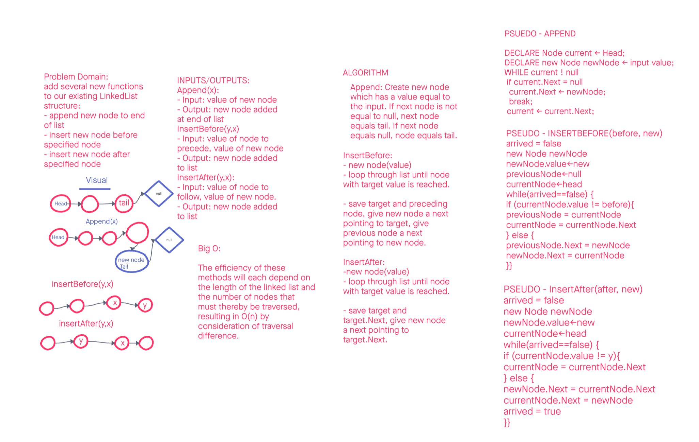

# Challenge 06: Linked List add Methods

Author: Steven Boston
Planning and Design in collaboration with: Joshua Haddock

This challenge asked us to add three new methods to our LinkedList class from the previous challenge:

- Append to end of list chain
- Insert before a particular node
- Insert after a particular node

## Whiteboard Process

## Approach & Efficiency

Each of the solutions we chose to implement requires the minimum number of repetitions to arrive at the necessary node to make the insertion, minimizing the computational load of the operations.

## Solution

This challenge set offers three methods within the LinkedList class:

- `AppendLinked(int value)`: provide a value and this method creates a new node to store the value and adds it to the end of the list chain.
- `InsertBefore(int target, int value )`: enter a target to relate the new value to and a new value and place a new node directly preceding the first insance of the target.
- `InsertAfter(int target, int value)`: the same tactics with InsertAfter allow you to place the new node after the target node instead.
