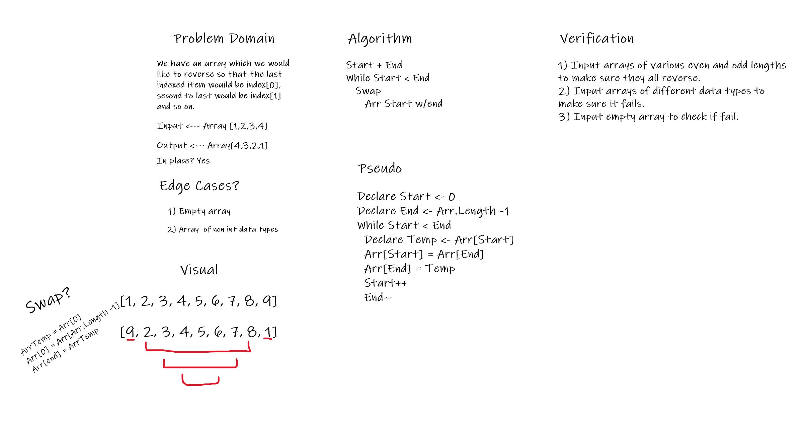

# Reverse an Array

This challenge asks us to reverse the order of an array in place, taking into account varying array sizes including empty arrays.

## Whiteboard Process

## Approach and Efficiency

Created by Benjamin Ibarra, Josh Haddock, Jona Brown & Steven Boston

- detailed a problem domain specifying the requirements of the challenge
- made a visual representation of the array value swapping
- wrote out the steps for the core algorithm
- wrote out Pseudo code detailing in plain english our codes intended structure and behavior
- outlined steps to verify our solution and test possible edge cases